# Technical Solution Writeup

## 1. Problem Statement

The goal is to classify a query point relative to a triangulated surface from STL as one of:

- `Outside`
- `Inside`
- `Boundary`

The current implementation is done entirely in c++ with no external dependencies, only c++ standard template libraries. The core idea here is to use a ray tracing logic (odd-even hits) to detect if a point is inside or outside. To accelerate the formulation for large number of input triangle (~1M triangles), a custom lightweight octree structure with a voxel fill step is utilized. Additionally, for the purposes of a demonstration a very basic hex mesher with refinement near the booundary surfaces is also implemented. Although not explicitly stated in the problem description, an assumption is made that the input STL is watertight and manifold (the CLI will throw an error if it isn't).

## 2. Algorithm and Implementation
### 2.1 Point-in-Polyhedron (Ray Casting)

In general there are two primary classes of PIP algorithms found across literature: ray casting and solid angle (winding number) type algorithms. Ray casting algorithms are typically quite cheap and fast when implemented with care. Their implementation is also much simpler than solid angle calculation. Additionally the solid angle path comes with trigonometric evaluations which are cost heavy. There are some newer version of solid angle PIPs which do not necessarily evaluate trigonometric functions, instead relying on casting a ray and "upgrading/downgrading" a winding number with respect to the triangle normals. However, this requires that all triangles are oriented correctly. Of course, the ray casting algorithm comes at the cost of floating point arithmetic limitations when on/near edges. The current implementation accounts for these issues by using a small buffer value to mark the ray casting decision ambiguous and try with a different ray again. Thus, owing to the simplicity and cost effectiveness of ray casting algorithms, the present PIP implementation uses ray casting to classify query points. The primary idea is that the inside/outside decision is based on a ray-casting parity rule: for a query point `p`, an odd number of surface intersections indicates the point is inside, while an even number indicates outside[^1]. This is the core point-in-polyhedron idea used in this implementation.
In the current code path, this decision is made in `pntClassifier::classify(const geometry::pnt3d&)` (`src/classifier.h`), with ray-based parity evaluation handled in `pntClassifier::_castRay(...)` (`src/classifier.h`). The classifier is called from `runGen(...)` and `runClassify(...)` in `src/main.cpp`.

### 2.2 Ray-Triangle Intersection

For each candidate triangle, intersection is computed with the Moller-Trumbore method[^2][^3] in `Ray::intersect(const triangle&)` (`src/ray.h`).  
The method solves a 3-variable linear system in terms of triangle barycentric coordinates and ray distance.

A point on the ray is:
\[
\mathbf{P} = \mathbf{O} + t\mathbf{D}
\]

A point on the triangle is:
\[
\mathbf{P} = \mathbf{V}_0 + u\mathbf{E}_1 + v\mathbf{E}_2
\]
where:
\[
\mathbf{E}_1 = \mathbf{V}_1 - \mathbf{V}_0,\quad
\mathbf{E}_2 = \mathbf{V}_2 - \mathbf{V}_0
\]

Equating both forms:
\[
\mathbf{O} + t\mathbf{D} = \mathbf{V}_0 + u\mathbf{E}_1 + v\mathbf{E}_2
\]
\[
\mathbf{S} := \mathbf{O} - \mathbf{V}_0 = u\mathbf{E}_1 + v\mathbf{E}_2 - t\mathbf{D}
\]

So the unknowns \((u,v,t)\) come from:
$$
\left[\mathbf{E}_1\ \mathbf{E}_2\ -\mathbf{D}\right]
\begin{bmatrix}
u\\
v\\
t
\end{bmatrix} = \mathbf{S}
$$

Moller-Trumbore evaluates this with scalar triple products (Cramer's-rule form):
\[
a = \mathbf{E}_1 \cdot (\mathbf{D} \times \mathbf{E}_2)
\]
\[
u = \frac{\mathbf{S}\cdot(\mathbf{D}\times\mathbf{E}_2)}{a},\quad
v = \frac{\mathbf{D}\cdot(\mathbf{S}\times\mathbf{E}_1)}{a},\quad
t = \frac{\mathbf{E}_2\cdot(\mathbf{S}\times\mathbf{E}_1)}{a}
\]

Geometrically, the implementation applies three checks:

1. $|a| < \epsilon$: ray is nearly parallel to triangle plane (reject).
2. Barycentric validity: reject if `u < 0`, `v < 0`, or `u + v > 1` (outside triangle).
3. Forward-hit validity: accept only if $t > \epsilon$ (intersection in front of origin).

In this implementation, near-edge/near-vertex barycentric cases are treated as ambiguous and returned as a special status (`-2`) in `Ray::intersect(const triangle&)` (`src/ray.h`), then retried with alternate ray directions inside `pntClassifier::_castRay(...)` (`src/classifier.h`) before final parity counting.

### 2.3 Boundary Handling

Parity alone does not robustly classify points that lie exactly on the surface. Therefore, boundary classification is handled explicitly before parity with:

1. Plane distance tolerance check
2. Barycentric inclusion tolerance check

This gives deterministic `Boundary` classification for face/edge/vertex cases.
This boundary-first workflow is implemented in `pntClassifier::classify(...)` via `_isOnBoundary(...)`, `_collectProbeTris(...)`, and `_ptOnTri(...)` in `src/classifier.h`.

### 2.4 Acceleration

#### 2.4.1 Octree Construction

To reduce brute-force triangle checks, the mesh is preprocessed into an octree (`src/octree.h`).  
The root box is built from global mesh bounds (with margin), and each node is recursively subdivided into 8 children until either:
- triangle count in node is at or below `min_tri`, or
- maximum depth of `max_depth` is reached.

Triangle-to-child assignment is conservative: a triangle is inserted into a child if the child AABB overlaps the triangle AABB and the child box intersects the triangle plane. This may duplicate triangle IDs across nearby children, but avoids missing boundary triangles.

#### 2.4.2 Voxel Fill (Leaf Status Preclassification)

After octree build, leaf nodes are pre-labeled (`src/classifier.h`) as:
- `BOUNDARY`: leaf contains at least one triangle
- `INTERNAL` or `EXTERNAL`: leaf has no triangles, so its center is classified by ray casting

This voxel-fill stage is an upfront preprocessing cost that speeds up later queries.  
If a query point falls in a leaf already labeled `INTERNAL` or `EXTERNAL`, classification is returned immediately without full ray-triangle traversal. It is worth noting that this pre-classification step does add some upfront overhead, but is well worth it for querying a large number of points among a large number of triangles.

#### 2.4.3 Slab Method for Ray-AABB Intersection

Ray traversal through the octree uses a slab test[^4] implemented in `Ray::intersect(const aabb&)` (`src/ray.h`).  
The same ray parameterization is used:
\[
\mathbf{r}(t)=\mathbf{O}+t\mathbf{D}
\]

For each axis, an entry and exit parameter are computed. Along the x-axis:
\[
t_{x1}=\frac{x_{min}-O_x}{D_x},\quad
t_{x2}=\frac{x_{max}-O_x}{D_x}
\]
and similarly for y and z.  
In code, these divisions are implemented as multiplication by precomputed inverse direction (`inv_dir`) from `Ray::Ray(...)`, with near-zero direction components guarded by `constants::BIG`.

The per-axis intervals are merged into one global overlap interval:
\[
t_{min}=\max\left(\min(t_{x1},t_{x2}),\min(t_{y1},t_{y2}),\min(t_{z1},t_{z2})\right)
\]
\[
t_{max}=\min\left(\max(t_{x1},t_{x2}),\max(t_{y1},t_{y2}),\max(t_{z1},t_{z2})\right)
\]

Geometrically, this means the ray intersects all three axis slabs simultaneously only when the global interval is valid.  
The final acceptance check in `Ray::intersect(const aabb&)` is:

1. `tmax >= tmin` (non-empty overlap interval)
2. `tmax >= 0` (box is not entirely behind the ray)

Using this recursively in `octreeNode::getIntersectedLeafs(...)` (`src/octree.h`) ensures that only octree nodes intersected by the ray are visited.

#### 2.4.4 Candidate Selection Before Moller-Trumbore

Before triangle-level Moller-Trumbore checks, candidates are filtered in two stages:

1. **Point-level voxel shortcut** (`_findNode`):
   - locate the voxel containing the query point
   - if voxel is `INTERNAL`/`EXTERNAL`, return directly

2. **Ray-path candidate collection** (`getIntersectedLeafs`):
   - collect only boundary leaves intersected by the ray (via slab test)
   - iterate triangle IDs from those leaves
   - deduplicate IDs (`tested_tris`) so each triangle is tested once per ray attempt

Only this reduced candidate set is passed to Moller-Trumbore intersection, which significantly reduces per-query cost.

## 3. Complexity Analysis
For a mesh with \(T\) triangles and \(Q\) query points, runtime can be expressed as:

\[
T_{\text{total}}(T,Q)=T_{\text{setup}}(T)+Q\cdot t_{\text{query}}(T)
\]

where setup is:
\[
T_{\text{setup}}(T)=T_{\text{STL}}(T)+T_{\text{octree}}(T)+T_{\text{voxel-fill}}(T)
\]

For proving the complexity analysis, 4 different geometries and 7 different query point sets are considered. To keep things uniform, the same cold plate geometry is utilized, however it is isotropically remeshed with different levels of refinement to derive additional geometries with 5,810; 509,998; and 1,900,352 triangles. The number of query points tested were 10 through $10^7$ on a log scale. The input geometry with their triangulation and the preprocessed octree voxels are shown below.

| Triangle Count | STL | Octree |
|---|---|---|
| 396 | 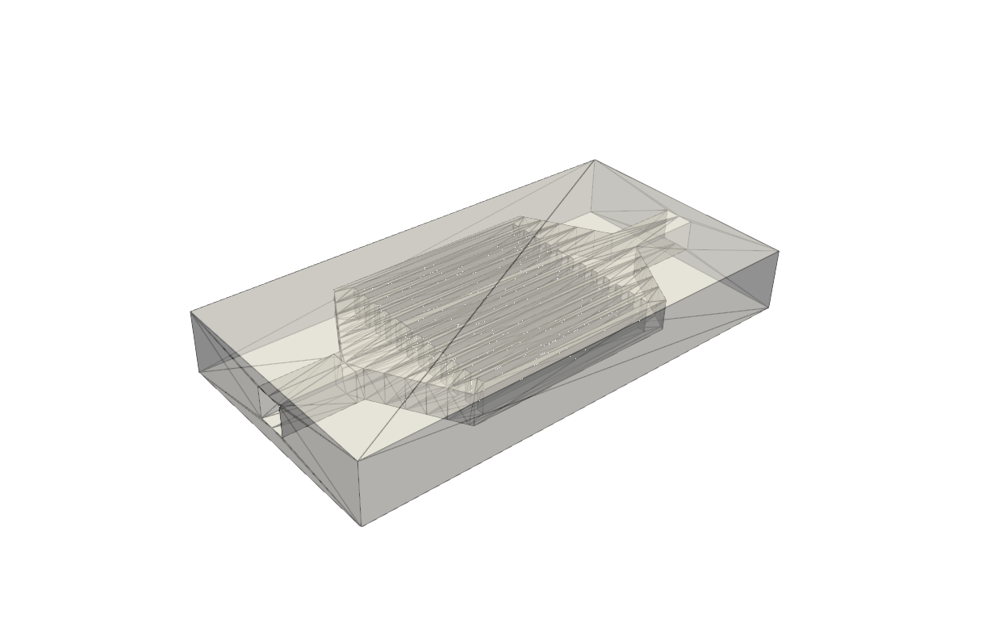 |  |
| 5,810 |  |  |
| 509,998 |  |  |
| 1,900,352 | 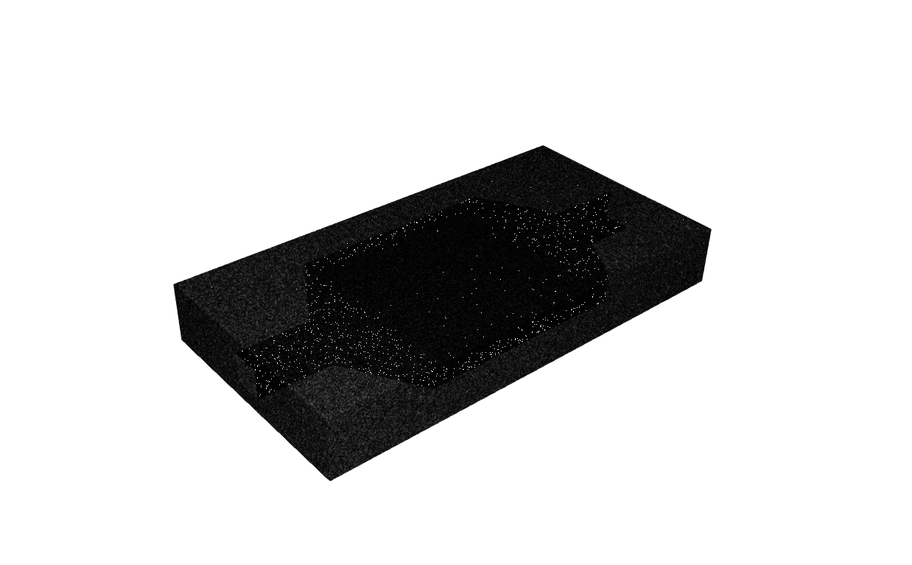 |  |

### 3.1 Query-Count Scaling (Plot 1, Plot 2)

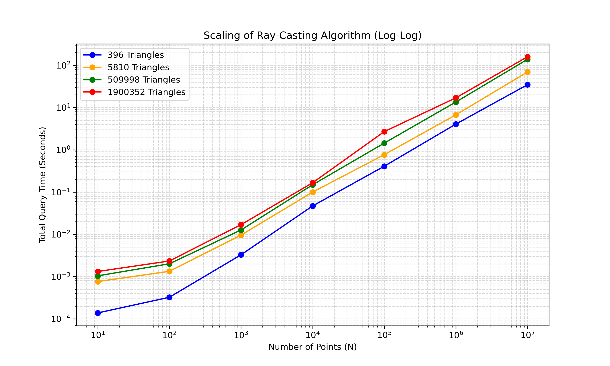
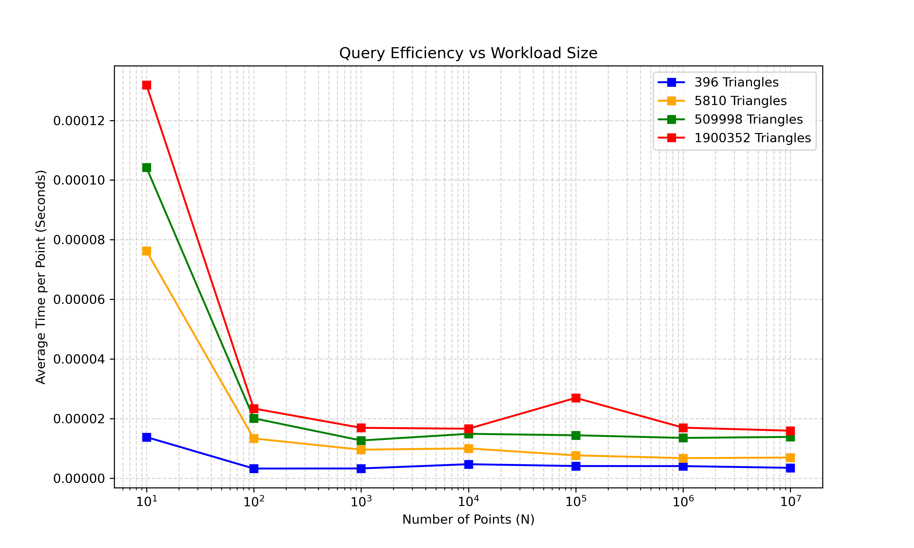

The log-log slopes of total query time vs \(N\) are:
- 396 tris: 0.9797
- 5,810 tris: 0.9913
- 509,998 tris: 0.9908
- 1,900,352 tris: 0.9867

These are close to 1, indicating near-\(O(Q)\) scaling for fixed geometry.

Average per-point time at \(N=10^7\):
- 396 tris: \(2.29\times10^{-6}\) s
- 5,810 tris: \(4.36\times10^{-6}\) s
- 509,998 tris: \(1.01\times10^{-5}\) s
- 1,900,352 tris: \(1.16\times10^{-5}\) s

So query cost increases with geometry complexity, but sublinearly relative to raw triangle growth due to octree pruning.

### 3.2 Setup-Time Scaling (Plot 3)

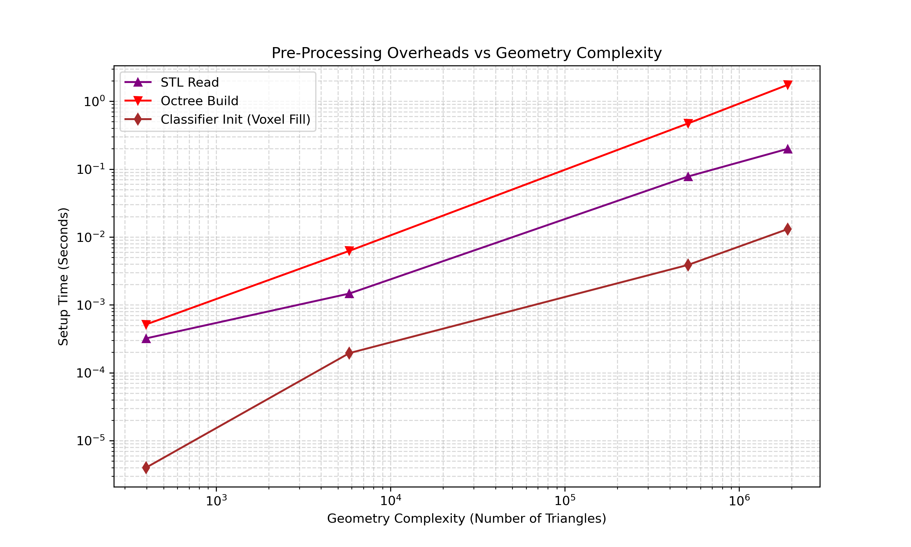

Preprocessing grows approximately linearly with triangle count:
- STL read exponent (5,810 -> 1,900,352 tris): \(\approx 0.95\)
- Octree build exponent (5,810 -> 1,900,352 tris): \(\approx 1.01\)
- Classifier init / voxel-fill exponent (5,810 -> 1,900,352 tris): \(\approx 1.01\)

This matches expected behavior for preprocessing-heavy stages.

### 3.3 Practical Takeaway

The implementation exhibits:
- near-linear scaling with number of query points,
- near-linear setup scaling with mesh size,
- good amortization behavior for large batch queries.

## 4. Geometry Case Studies

### 4.1 Cold Plate Geometry Results

A finer version of the originially shared stl with 509,998 triangles was used here. The tool was executed in gen mode with 500,000 randomly generated query points. It is worth noting here that the unique points on the STL itself were also inserted into the query point vector to ensure that some points on the actual boundary of the geometry are also forcibly queried. The following table shows the STL geometry, the Octree constructed for the voxel fill, and the points. The blue points correspond to `Outside`, the red points corresponds to `Boundary` and the green points correspond to `Inside`.

| Item | Representation |
|---|---|
| STL visualization | 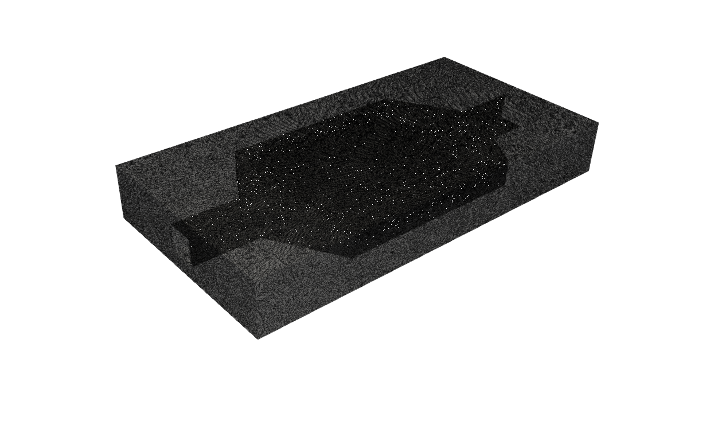 |
| Octree visualization |  |
| Points visualization | 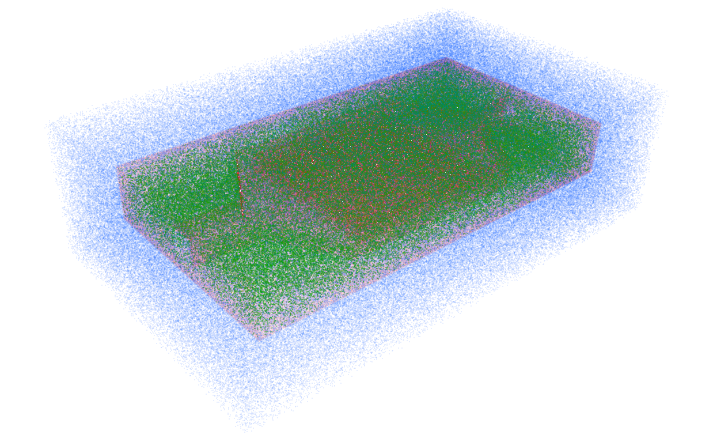 |

### 4.2 David Bust Geometry Results

A refrence stl of Michelangelo's David's bust with 1,083,370 triangles was used here. The tool was executed in gen mode with 500,000 randomly generated query points. It is worth noting here that the unique points on the STL itself were also inserted into the query point vector to ensure that some points on the actual boundary of the geometry are also forcibly queried. The following table shows the STL geometry, the Octree constructed for the voxel fill, and the points. The blue points correspond to `Outside`, the red points corresponds to `Boundary` and the green points correspond to `Inside`.

| Item | Representation |
|---|---|
| STL visualization | 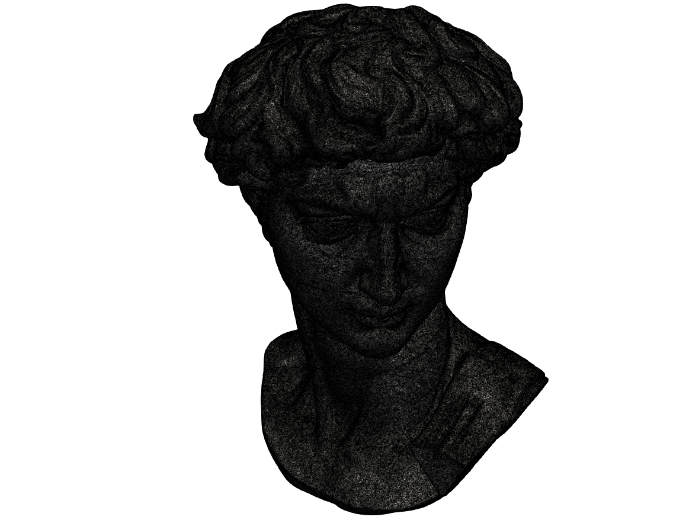 |
| Octree visualization |  |
| Points visualization | 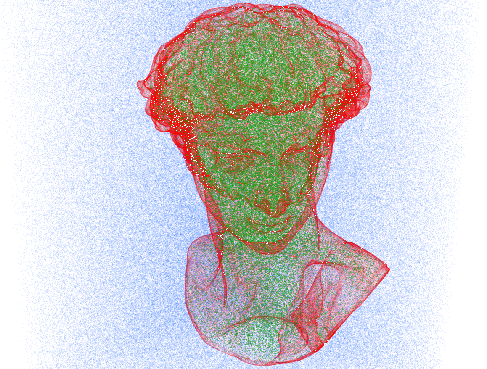 |

### 4.3 Stanford Dragon Geometry Results

A refrence stl of the Stanford Dragon with 318,460 triangles was used here. The tool was executed in gen mode with 500,000 randomly generated query points. It is worth noting here that the unique points on the STL itself were also inserted into the query point vector to ensure that some points on the actual boundary of the geometry are also forcibly queried. The following table shows the STL geometry, the Octree constructed for the voxel fill, and the points. The blue points correspond to `Outside`, the red points corresponds to `Boundary` and the green points correspond to `Inside`.

| Item | Representation |
|---|---|
| STL visualization |  |
| Octree visualization |  |
| Points visualization |  |

## 5. Mesher Results

A lightweight Cartesian hexahedral mesher is implemented in `mesher::MeshGenerator::mesh(...)` (`src/mesher.h`) as a demonstration stage after classification.  
The mesher starts from a coarse background grid (`initial_res^3`) over the domain bounds, recursively refines cells that intersect the surface (`octreeNode::intersect_box(...)`), and keeps only cells whose centers classify as `Inside` using `pntClassifier::classify(...)`.

The following figures show representative generated meshes for the three case-study geometries. All the three meshes were generated with a `mesh-res` of 10 and a `mesh-depth` of 5. It is worth noting here that the mesh generation is only a basic implementation and no additional treatment has been done on the boundaries and thus the stairstepping on the boundaries.

| Geometry | Generated Mesh (View 1)| Generated Mesh (View 2)|
|---|---|---|
| Cold plate (509,998 tris) | 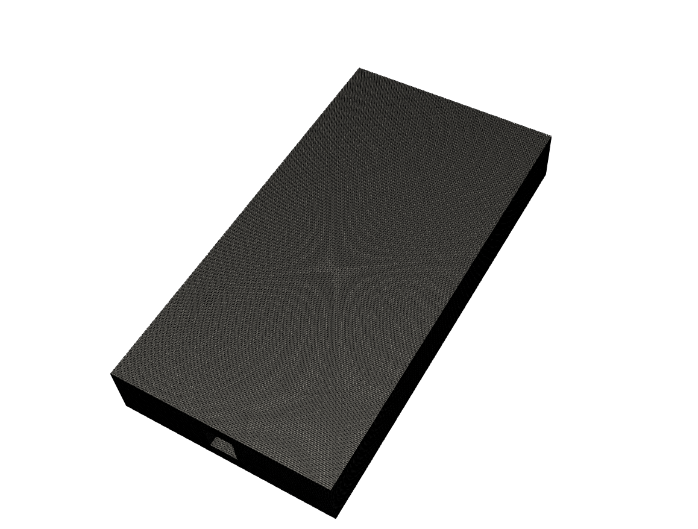 |  |
| David bust (1,083,370 tris) |  | 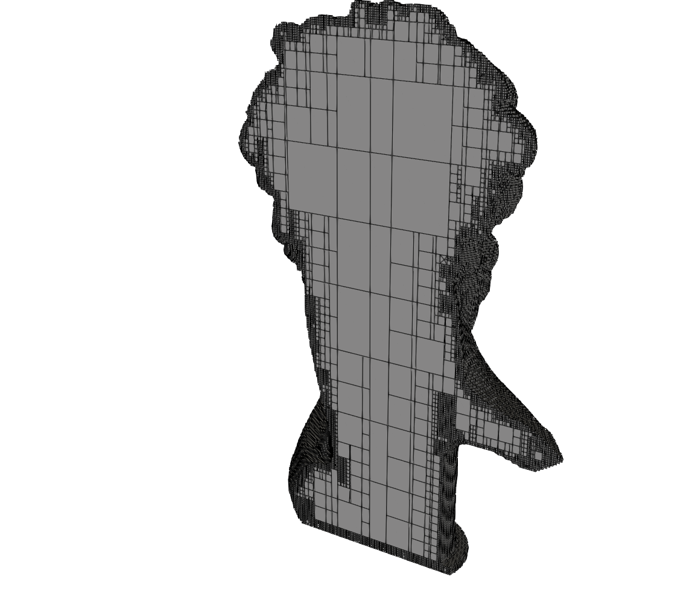 |
| Stanford Dragon (318,460 tris) | 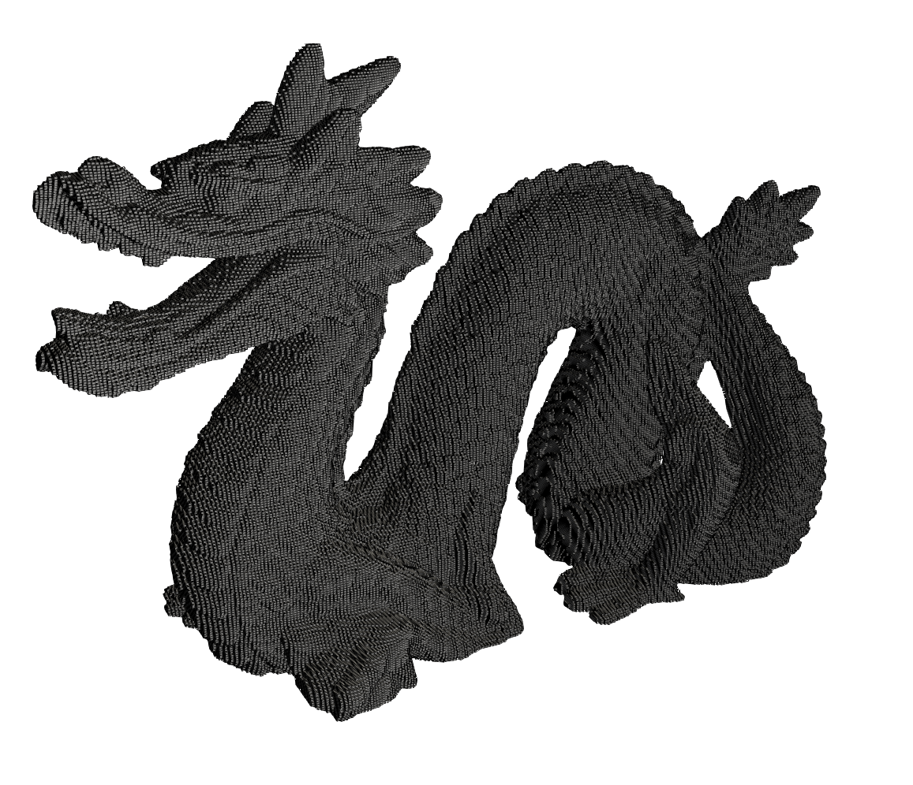 | 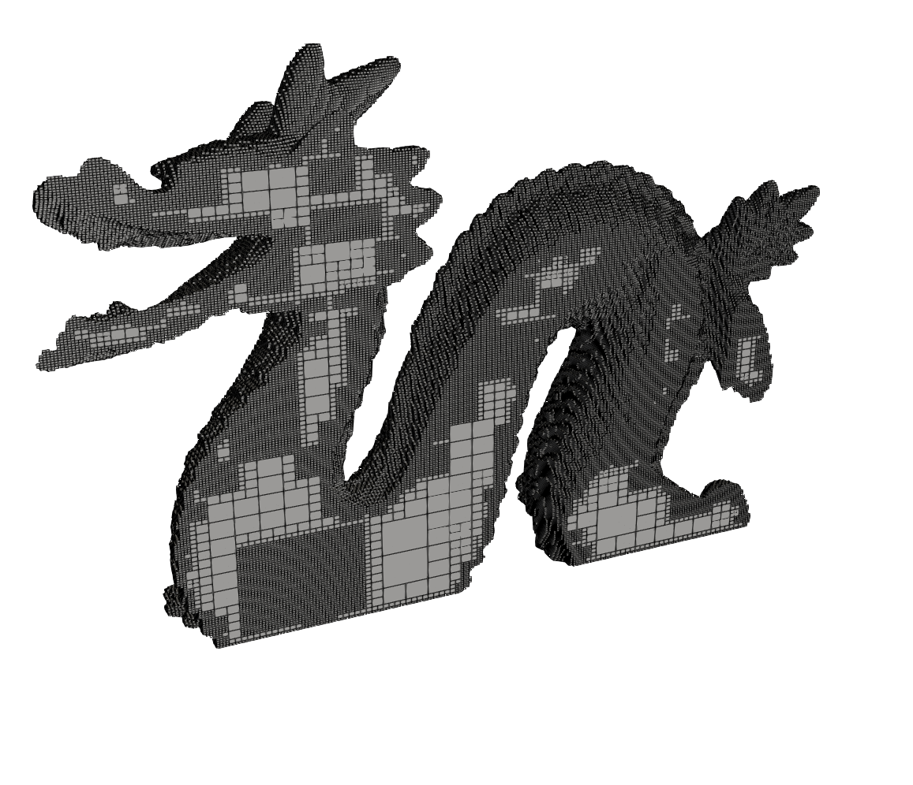 |

## 6. Testing and Validation

### 6.1 Example Classification Cases

To validate the tri-state output (`Outside`, `Inside`, `Boundary`) deterministically, a synthetic unit cube test case is used in `tests/test_classifier.cpp`.

Representative query points and expected classes:

| Query Point \((x,y,z)\) | Expected Class | Purpose |
|---|---|---|
| \((0.5, 0.5, 0.5)\) | `Inside` | interior point |
| \((2.0, 0.5, 0.5)\) | `Outside` | clear exterior point |
| \((0.0, 0.5, 0.5)\) | `Boundary` | face boundary |
| \((0.0, 0.0, 0.5)\) | `Boundary` | edge boundary |
| \((0.0, 0.0, 0.0)\) | `Boundary` | vertex boundary |
| \((+d, 0.5, 0.5)\), \(d=10^{-6}\) | `Inside` | positive face perturbation |
| \((-d, 0.5, 0.5)\), \(d=10^{-6}\) | `Outside` | negative face perturbation |
| \((+d,+d,0.5)\), \(d=10^{-6}\) | `Inside` | positive edge perturbation |
| \((-d,-d,0.5)\), \(d=10^{-6}\) | `Outside` | negative edge perturbation |
| \((+d,+d,+d)\), \(d=10^{-6}\) | `Inside` | positive vertex perturbation |
| \((-d,-d,-d)\), \(d=10^{-6}\) | `Outside` | negative vertex perturbation |

These examples verify both exact boundary handling and local robustness around boundary transitions.

### 6.2 Example STL Parser Cases

`tests/test_stl_parser.cpp` programmatically creates minimal fixtures and verifies parser behavior:

- one-triangle ASCII STL fixture
- one-triangle binary STL fixture

For both fixtures, the test checks:

- triangle count
- vertex coordinates
- computed normal
- computed triangle AABB

This ensures ASCII/binary read paths and geometry post-processing are validated with deterministic expected values.

### 6.3 Automated Test Suite

Current automated tests:

- `tests/test_stl_parser.cpp` (parser correctness)
- `tests/test_classifier.cpp` (classification correctness on synthetic geometry)

Shared test helpers are provided in:

- `tests/test.h`

Execution:

- local: `ctest --test-dir build --output-on-failure`
- CI: `.github/workflows/ci.yml` runs CMake configure/build and `ctest` on push and pull requests

The current suite emphasizes core algorithmic correctness and deterministic edge-case behavior, while integration and stress tests can be extended in future work.

## 7. Future Improvements

1. **Parallel preprocessing and query execution**
   Parallelize octree construction, voxel-fill classification, and batch point queries. This should improve throughput significantly for million-triangle meshes and large query sets.

2. **Better meshing**
   Extend the Cartesian mesher with curvature- or feature-aware refinement criteria, quality metrics, and optional smoothing/post-processing. This would improve mesh fidelity around sharp geometric details.

3. **Broader validation suite**
   Right now the unit testing is quite limited, essentially just to the stl parser and the classifier. And implicitly checks the triangle compute. A more robust test suite can be incorporated to make future additions bullet proof.

## References
[^1]: Horvat, M. Ray Casting Point-in-Polyhedron Test. CESCG 2012.

[^2]: Moller, T., and Trumbore, B. Fast, Minimum Storage Ray-Triangle Intersection. Journal of Graphics Tools, 2(1), 1997.

[^3]: https://en.wikipedia.org/wiki/M%C3%B6ller%E2%80%93Trumbore_intersection_algorithm

[^4]: https://en.wikipedia.org/wiki/Slab_method
